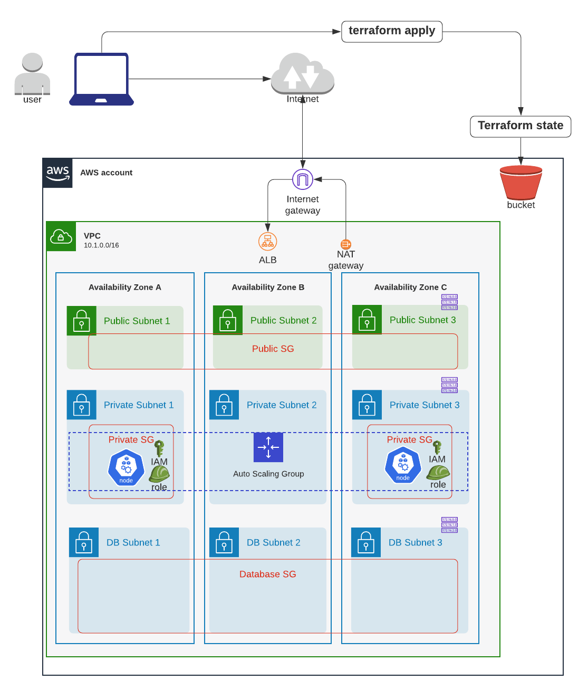

# Create EKS Cluster




Project architecture:
```sh
.
├── README.md
├── composition
│   ├── eks-demo-infra # <--- Step 3: Create Composition layer and define all the required inputs to Infrastructure module's EKS main.tf
│   │   └── ap-northeast-1
│   │       └── prod
│   │           ├── backend.config
│   │           ├── data.tf
│   │           ├── main.tf # <----- this is the entry point for EKS
│   │           ├── outputs.tf
│   │           ├── providers.tf
│   │           ├── terraform.tfenvs
│   │           └── variables.tf
│   └── terraform-remote-backend 
│       └── ap-northeast-1 
│           └── prod      
│               ├── data.tf
│               ├── main.tf 
│               ├── outputs.tf
│               ├── providers.tf
│               ├── terraform.tfstate
│               ├── terraform.tfstate.backup
│               ├── terraform.tfvars
│               └── variables.tf
├── infrastructure_modules 
│   ├── eks # <---- Step 2: Create Infrastructure Modules for VPC and Consume Resource Modules
│   │   ├── data.tf
│   │   ├── main.tf
│   │   ├── outputs.tf
│   │   ├── template
│   │   │   └── ssm_document_cleanup_docker_images.yaml
│   │   └── variables.tf
│   ├── terraform_remote_backend
│   │   ├── data.tf
│   │   ├── main.tf
│   │   ├── outputs.tf
│   │   └── variables.tf
│   └── vpc
│       ├── data.tf
│       ├── main.tf
│       ├── outputs.tf
│       ├── provider.tf
│       ├── variables.tf
│       └── versions.tf
└── resource_modules 
    ├── compute
    │   ├── ec2_key_pair
    │   │   ├── main.tf
    │   │   ├── output.tf
    │   │   └── variables.tf
    │   └── security_group
    │       ├── main.tf
    │       ├── outputs.tf
    │       ├── rules.tf
    │       ├── update_groups.sh
    │       └── variables.tf
    ├── container
    │   ├── ecr
    │   │   ├── main.tf
    │   │   ├── outputs.tf
    │   │   └── variables.tf
    │   └── eks # <----- Step 1: Replicate remote TF modules in local Resource Modules
    │       ├── _user_data
    │       │   ├── main.tf
    │       │   ├── outputs.tf
    │       │   ├── variables.tf
    │       │   └── versions.tf
    │       ├── eks-managed-node-group
    │       │   ├── main.tf
    │       │   ├── outputs.tf
    │       │   ├── variables.tf
    │       │   └── versions.tf
    │       ├── fargate-profile
    │       │   ├── main.tf
    │       │   ├── outputs.tf
    │       │   ├── variables.tf
    │       │   └── versions.tf
    │       ├── karpenter
    │       │   ├── main.tf
    │       │   ├── outputs.tf
    │       │   ├── variables.tf
    │       │   └── versions.tf
    │       ├── main.tf
    │       ├── modules
    │       │   ├── _user_data
    │       │   │   ├── main.tf
    │       │   │   ├── outputs.tf
    │       │   │   ├── variables.tf
    │       │   │   └── versions.tf
    │       │   ├── eks-managed-node-group
    │       │   │   ├── main.tf
    │       │   │   ├── outputs.tf
    │       │   │   ├── variables.tf
    │       │   │   └── versions.tf
    │       │   ├── fargate-profile
    │       │   │   ├── main.tf
    │       │   │   ├── outputs.tf
    │       │   │   ├── variables.tf
    │       │   │   └── versions.tf
    │       │   └── self-managed-node-group
    │       │       ├── main.tf
    │       │       ├── outputs.tf
    │       │       ├── variables.tf
    │       │       └── versions.tf
    │       ├── node_groups.tf
    │       ├── outputs.tf
    │       ├── self-managed-node-group
    │       │   ├── main.tf
    │       │   ├── outputs.tf
    │       │   ├── variables.tf
    │       │   └── versions.tf
    │       ├── templates
    │       │   ├── aws_auth_cm.tpl
    │       │   ├── bottlerocket_user_data.tpl
    │       │   ├── linux_user_data.tpl
    │       │   └── windows_user_data.tpl
    │       ├── variables.tf
    │       └── versions.tf
    ├── database
    │   └── dynamodb
    │       ├── main.tf
    │       ├── outputs.tf
    │       └── variables.tf
    ├── identity
    │   └── kms_key
    │       ├── main.tf
    │       ├── outputs.tf
    │       └── variables.tf 
    ├── network
    │   └── vpc 
    │       ├── main.tf
    │       ├── outputs.tf
    │       └── variables.tf
    └── storage
        └── s3   
            ├── main.tf      
            ├── outputs.tf
            └── variables.tf
```

# Step 1: Replicate Remote TF modules for EKS in local Resource Modules

## EKS
Copy paste all the .tf and `/templates` and `/scripts` at the root of this repo https://github.com/terraform-aws-modules/terraform-aws-eks to `resource_modules/network/vpc`.

In [resource_modules/container/eks/variables.tf](resource_modules/container/eks/variables.tf),
```sh
# externalize this var so value can be injected at higher level (infra modules)
variable "key_name" {
  default = ""
}
```


# Step 2: Create Infrastructure Modules for EKS and Consume Resource Modules

Using [AWS EKS Terraform Remote Module's examples](https://github.com/terraform-aws-modules/terraform-aws-eks/blob/master/examples/complete/main.tf), create EKS infra module's main.tf.

In [infrastructure_modules/eks/main.tf](infrastructure_modules/eks/main.tf), module `eks` will act as a __facade__ to many sub-components such as EKS cluster, EKS worker nodes, IAM roles, worker launch template, security groups, auto scaling groups, etc.

```sh
module "key_pair" {
  source = "../../resource_modules/compute/ec2_key_pair"

  key_name   = local.key_pair_name
  public_key = local.public_key
}

# ref: https://github.com/terraform-aws-modules/terraform-aws-eks/blob/master/examples/complete/main.tf
module "eks_cluster" {
  source = "../../resource_modules/container/eks"

  create = var.create_eks

  cluster_name                   = var.cluster_name
  cluster_version                = var.cluster_version
  cluster_endpoint_public_access = var.cluster_endpoint_public_access

  cluster_enabled_log_types              = var.enabled_cluster_log_types
  cloudwatch_log_group_retention_in_days = var.cluster_log_retention_in_days

  # WARNING: changing this will force recreating an entire EKS cluster!!!
  # enable k8s secret encryption using AWS KMS. Ref: https://github.com/terraform-aws-modules/terraform-aws-eks/blob/master/examples/secrets_encryption/main.tf#L88
  cluster_encryption_config = {
    provider_key_arn = module.k8s_secret_kms_key.arn
    resources        = ["secrets"]
  }

  key_name = module.key_pair.key_name

  vpc_id     = var.vpc_id
  subnet_ids = var.subnets

  # Self Managed Node Group(s)
  # self_managed_node_groups takes precedence to self_managed_node_group_defaults
  self_managed_node_groups = var.self_managed_node_groups

  self_managed_node_group_defaults = {
    key_name = module.key_pair.key_name

    iam_role_additional_policies = {}
  }

  # aws-auth configmap
  manage_aws_auth_configmap = var.manage_aws_auth_configmap
  create_aws_auth_configmap = var.create_aws_auth_configmap
  aws_auth_roles            = var.aws_auth_roles
  aws_auth_users            = var.aws_auth_users

  # Extend node-to-node security group rules. Ref: https://github.com/terraform-aws-modules/terraform-aws-eks/blob/master/examples/self_managed_node_group/main.tf#L78
  # WARNING: need this for metrics-server to work, asn well as istio ingress/egress's readiness to work at http://:15021/healthz/ready. Ref: https://github.com/kubernetes-sigs/metrics-server/issues/1024#issuecomment-1124870217
  node_security_group_additional_rules = {
    ingress_self_all = {
      description = "Node to node all ports/protocols"
      protocol    = "-1"
      from_port   = 0
      to_port     = 0
      type        = "ingress"
      self        = true
    },
    egress_all = {
      description = "Node to all ports/protocols" # WARNING: need this for egress to mongoDB 27017-27019
      protocol    = "-1"
      from_port   = 0
      to_port     = 0
      type        = "egress"
      cidr_blocks = ["0.0.0.0/0"]
    },
    ingress_cluster_api_ephemeral_ports_tcp = {
      description                   = "Cluster API to K8S services running on nodes"
      protocol                      = "tcp"
      from_port                     = 1025
      to_port                       = 65535
      type                          = "ingress"
      source_cluster_security_group = true
    },
  }

  # WARNING: needs this to allow kubeseal to work. Ref: https://github.com/bitnami-labs/sealed-secrets/issues/699#issuecomment-1064424553
  cluster_security_group_additional_rules = {
    egress_nodes_ephemeral_ports_tcp = {
      description                = "Cluster API to K8S services running on nodes"
      protocol                   = "tcp"
      from_port                  = 1025
      to_port                    = 65535
      type                       = "egress"
      source_node_security_group = true
    }
  }

  tags = var.tags
}

# ########################################
# ## KMS for K8s secret's DEK (data encryption key) encryption
# ########################################
module "k8s_secret_kms_key" {
  source = "../../resource_modules/identity/kms_key"

  name                    = local.k8s_secret_kms_key_name
  description             = local.k8s_secret_kms_key_description
  deletion_window_in_days = local.k8s_secret_kms_key_deletion_window_in_days
  tags                    = local.k8s_secret_kms_key_tags
  policy                  = data.aws_iam_policy_document.k8s_api_server_decryption.json
  enable_key_rotation     = true
}
```


Create public and private key locally using `ssh-keygen`, then copy public key content in [infrastructure_modules/eks/data.tf](infrastructure_modules/eks/data.tf):

```sh
locals {
  ## Key Pair ##
  key_pair_name = "eks-workers-keypair-${var.region_tag[var.region]}-${var.env}-${var.app_name}"
  # run "ssh-keygen" then copy public key content to public_key
  public_key    = "XYZXYZ"  # <----- here

```


# Step 3: Create Composition layer and define all the required inputs to Infrastructure VPC module's main.tf

In [composition/eks-demo-infra/ap-northeast-1/prod/main.tf](composition/eks-demo-infra/ap-northeast-1/prod/main.tf), a single module called `vpc` is defined.


```sh
########################################
# EKS
########################################
module "eks" {
  source = "../../../../infrastructure_modules/eks"

  ## EKS ##
  create_eks                     = var.create_eks
  cluster_version                = var.cluster_version
  cluster_name                   = local.cluster_name
  cluster_endpoint_public_access = var.cluster_endpoint_public_access
  vpc_id                         = module.vpc.vpc_id
  subnets                        = module.vpc.private_subnets

  # note: either pass worker_groups or node_groups
  # this is for (EKSCTL API) unmanaged node group
  self_managed_node_groups = var.self_managed_node_groups

  # this is for (EKS API) managed node group
  eks_managed_node_groups = var.eks_managed_node_groups

  manage_aws_auth_configmap = var.manage_aws_auth_configmap
  create_aws_auth_configmap = var.create_aws_auth_configmap
  # add roles that can access K8s cluster
  aws_auth_roles = local.aws_auth_roles
  # add IAM users who can access K8s cluster
  aws_auth_users = var.aws_auth_users

  ## Common tag metadata ##
  env      = var.env
  app_name = var.app_name
  tags     = local.eks_tags
  region   = var.region
}
```

Also, you need to define `kubernetes` version in [composition/eks-demo-infra/ap-northeast-1/prod/versions.tf](composition/eks-demo-infra/ap-northeast-1/prod/versions.tf)
```sh
terraform {
  required_version = ">= 1.0"

  required_providers {
    aws = {
      source  = "hashicorp/aws"
      version = ">= 4.47.0"
    }
    tls = {
      source  = "hashicorp/tls"
      version = ">= 3.0"
    }
    kubernetes = {
      source  = "hashicorp/kubernetes"
      version = ">= 2.10"
    }
    time = {
      source  = "hashicorp/time"
      version = ">= 0.9"
    }
  }
}
```

So is [composition/eks-demo-infra/ap-northeast-1/prod/providers.tf](composition/eks-demo-infra/ap-northeast-1/prod/providers.tf)
```sh
# In case of not creating the cluster, this will be an incompletely configured, unused provider, which poses no problem.
# ref: https://registry.terraform.io/providers/hashicorp/kubernetes/latest/docs
# In case of not creating the cluster, this will be an incompletely configured, unused provider, which poses no problem.
# ref: https://github.com/terraform-aws-modules/terraform-aws-eks/blob/v12.1.0/README.md#conditional-creation, https://github.com/terraform-aws-modules/terraform-aws-eks/issues/911
provider "kubernetes" {
  host                   = module.eks.cluster_endpoint
  cluster_ca_certificate = base64decode(module.eks.cluster_certificate_authority_data)

  exec {
    api_version = "client.authentication.k8s.io/v1beta1"
    command     = "aws"
    # This requires the awscli to be installed locally where Terraform is executed
    args = ["eks", "get-token", "--cluster-name", module.eks.cluster_name]
  }
}
```

And data
```sh
# if you leave default value of "manage_aws_auth = true" then you need to configure the kubernetes provider as per the doc: https://github.com/terraform-aws-modules/terraform-aws-eks/blob/v12.1.0/README.md#conditional-creation, https://github.com/terraform-aws-modules/terraform-aws-eks/issues/911
data "aws_eks_cluster" "cluster" {
  count = var.create_eks ? 1 : 0
  name  = module.eks.cluster_id
}

data "aws_eks_cluster_auth" "cluster" {
  count = var.create_eks ? 1 : 0
  name  = module.eks.cluster_id
}
```


Finally supply input variable values in [composition/eks-demo-infra/ap-northeast-1/prod/terraform.tfvars](composition/eks-demo-infra/ap-northeast-1/prod/terraform.tfvars):

```sh
########################################
# EKS
########################################
cluster_version                = 1.27
cluster_endpoint_public_access = true # need this otherwise can't access EKS from outside VPC. Ref: https://github.com/terraform-aws-modules/terraform-aws-eks#input_cluster_endpoint_public_access

# if set to true, AWS IAM Authenticator will use IAM role specified in "role_name" to authenticate to a cluster
authenticate_using_role = true

# if set to true, AWS IAM Authenticator will use AWS Profile name specified in profile_name to authenticate to a cluster instead of access key and secret access key
authenticate_using_aws_profile = false

# add other IAM users who can access a K8s cluster (by default, the IAM user who created a cluster is given access already)
aws_auth_users = []

# WARNING: mixing managed and unmanaged node groups will render unmanaged nodes to be unable to connect to internet & join the cluster when restarting.
# how many groups of K8s worker nodes you want? Specify at least one group of worker node
# gotcha: managed node group doesn't support 1) propagating taint to K8s nodes and 2) custom userdata. Ref: https://eksctl.io/usage/eks-managed-nodes/#feature-parity-with-unmanaged-nodegroups
node_groups = {
  # staging = {
  #   desired_capacity = 1
  #   max_capacity     = 3
  #   min_capacity     = 1

  #   instance_type = "m3.large"
  #   k8s_labels = {
  #     env = "staging"
  #     managed-node = "true"
  #     GithubRepo  = "terraform-aws-eks"
  #     GithubOrg   = "terraform-aws-modules"
  #   }
  #   additional_tags = {
  #     "k8s.io/cluster-autoscaler/managed-node" = "true",
  #     "k8s.io/cluster-autoscaler/enabled" = "true",
  #     "k8s.io/cluster-autoscaler/node-template/taint/staging-only" = "true:PreferNoSchedule" # currently managed group can't assign taint to nodes from tags. Ref: https://eksctl.io/usage/eks-managed-nodes/#feature-parity-with-unmanaged-nodegroups
  #   }
  # },
}

# note (only for unmanaged node group)
# gotcha: need to use kubelet_extra_args to propagate taints/labels to K8s node, because ASG tags not being propagated to k8s node objects.
# ref: https://github.com/kubernetes/autoscaler/issues/1793#issuecomment-517417680
# ref: https://github.com/kubernetes/autoscaler/issues/2434#issuecomment-576479025
# example: https://github.com/terraform-aws-modules/terraform-aws-eks/blob/master/examples/self_managed_node_group/main.tf#L102-L194
self_managed_node_groups = {
  prod = {
    name          = "worker-group-prod-1"
    instance_type = "m3.medium" # since we are using AWS-VPC-CNI, allocatable pod IPs are defined by instance size: https://docs.google.com/spreadsheets/d/1MCdsmN7fWbebscGizcK6dAaPGS-8T_dYxWp0IdwkMKI/edit#gid=1549051942, https://github.com/awslabs/amazon-eks-ami/blob/master/files/eni-max-pods.txt
    max_size      = 1
    min_size      = 1
    desired_size  = 1 # this will be ignored if cluster autoscaler is enabled: asg_desired_capacity: https://github.com/terraform-aws-modules/terraform-aws-eks/blob/master/docs/autoscaling.md#notes
    # this userdata will 1) block access to metadata to avoid pods from using node's IAM instance profile, 2) create /mnt/efs and auto-mount EFS to it using fstab, 3) install AWS Inspector agent,  4) install SSM agent. Note: userdata script doesn't resolve shell variable defined within,
    # ref: https://docs.aws.amazon.com/eks/latest/userguide/restrict-ec2-credential-access.html
    # UPDATE: Datadog agent needs to ping the EC2 metadata endpoint to retrieve the instance id and resolve duplicated hosts to be a single host, and currently no altenative solution so need to allow access to instance metadata unfortunately otherwise infra hosts get counted twice
    # additional_userdata = "yum install -y iptables-services; iptables --insert FORWARD 1 --in-interface eni+ --destination 169.254.169.254/32 --jump DROP; iptables-save | tee /etc/sysconfig/iptables; systemctl enable --now iptables; sudo mkdir /mnt/efs; sudo mount -t nfs -o nfsvers=4.1,rsize=1048576,wsize=1048576,hard,timeo=600,retrans=2,noresvport fs-02940981.efs.us-east-1.amazonaws.com:/ /mnt/efs; echo 'fs-02940981.efs.us-east-1.amazonaws.com:/ /mnt/efs nfs defaults,vers=4.1 0 0' >> /etc/fstab; sudo yum install -y https://s3.us-east-1.amazonaws.com/amazon-ssm-us-east-1/latest/linux_amd64/amazon-ssm-agent.rpm; sudo systemctl enable amazon-ssm-agent; sudo systemctl start amazon-ssm-agent"
    # escape double qoute in TF variable to avoid /bin/bash not found error when executing install-linx.sh. Ref: https://discuss.hashicorp.com/t/how-can-i-escape-double-quotes-in-a-variable-value/4697/2

    tags = {
      "unmanaged-node"                    = "true"
      "k8s.io/cluster-autoscaler/enabled" = "true" # need this tag so clusterautoscaler auto-discovers node group: https://github.com/terraform-aws-modules/terraform-aws-eks/blob/master/docs/autoscaling.md
      "k8s_namespace"                     = "prod"
      "env"                               = "prod"
    }
  },
}

manage_aws_auth_configmap = true
create_aws_auth_configmap = true
```

Then run terraform commands
```sh
cd composition/eks-demo-infra/ap-northeast-1/prod

# will use remote backend
terraform init -backend-config=backend.config

# usual steps
terraform plan
terraform apply

# wait for about 15 minutes!!
module.eks.module.eks_cluster.null_resource.wait_for_cluster[0]: Still creating... [14m51s elapsed]
module.eks.module.eks_cluster.null_resource.wait_for_cluster[0]: Still creating... [15m1s elapsed]
module.eks.module.eks_cluster.null_resource.wait_for_cluster[0]: Creation complete after 15m6s [id=2913039165535485096]
data.aws_eks_cluster_auth.cluster[0]: Reading...
data.aws_eks_cluster.cluster[0]: Reading...
data.aws_eks_cluster_auth.cluster[0]: Read complete after 0s [id=eks-apne1-prod-terraform-eks-demo-infra]
data.aws_eks_cluster.cluster[0]: Read complete after 1s [id=eks-apne1-prod-terraform-eks-demo-infra]
module.eks.module.eks_cluster.kubernetes_config_map.aws_auth[0]: Creating...
module.eks.module.eks_cluster.kubernetes_config_map.aws_auth[0]: Creation complete after 2s [id=kube-system/aws-auth]

# Successful output
Apply complete! Resources: 36 added, 0 changed, 0 destroyed.
```


## Step 4: Configure local kubeconfig to access EKS cluster
Ref: https://kubernetes.io/docs/tasks/access-application-cluster/configure-access-multiple-clusters/


By default, kubectl will look for kubeconfig stored in `~/.kube/config`, if not then the path found in env variable `KUBECONFIG`.


### Scenario 1: the default kubeconfig is empty
If you don't have any other k8s cluster config stored in `~/.kube/config`, then you can overwrite it with the EKS cluster config.

First output kubeconfig contents using `terraform output`:
```sh
# show contents of kubeconfig for this EKS cluster
terraform output eks_kubeconfig

# show file name of kubeconfig stored locally
terraform output eks_kubeconfig_filename

# optionally, you can write contents to the default kubeconfig path
terraform output eks_kubeconfig > `~/.kube/config`

# check authentication
kubectl cluster-info

# output
Kubernetes master is running at https://EFFDE7B864F8D3778BD3417E5572FAE0.gr7.ap-northeast-1.eks.amazonaws.com
CoreDNS is running at https://EFFDE7B864F8D3778BD3417E5572FAE0.gr7.ap-northeast-1.eks.amazonaws.com/api/v1/namespaces/kube-system/services/kube-dns:dns/proxy

To further debug and diagnose cluster problems, use 'kubectl cluster-info dump'.
```

### Scenario 2: the default kubeconfig is NOT empty and you will manually edit it
If you already have another k8s cluster config in `~/.kube/config` and you don't want to overwrite the file, you can manually edit the file by adding the EKS cluster info.

### Scenario 3: the default kubeconfig is NOT empty and you want to keep a separate kubeconfig file
Or you can pass `-kubeconfig` argument to `kubectl` command to refer to other kubeconfig file without editing `~/.kube/config` at all
```sh
# write contents to the default kubeconfig path
terraform output eks_kubeconfig > `~/.kube/eks-apne1-prod-terraform-eks-demo-infra`

# check authentication by specifying a non-default kubeconfig file path
kubectl cluster-info \
  --kubeconfig=./kubeconfig_eks-apne1-prod-terraform-eks-demo-infra

# output
Kubernetes master is running at https://EFFDE7B864F8D3778BD3417E5572FAE0.gr7.ap-northeast-1.eks.amazonaws.com
CoreDNS is running at https://EFFDE7B864F8D3778BD3417E5572FAE0.gr7.ap-northeast-1.eks.amazonaws.com/api/v1/namespaces/kube-system/services/kube-dns:dns/proxy

To further debug and diagnose cluster problems, use 'kubectl cluster-info dump'.

# you need to specify --kubeconfig for each kubectl command
kubectl get po --kubeconfig=./kubeconfig_eks-apne1-prod-terraform-eks-demo-infra

# if you don't want to pass --kubeconfig everytime, you can set ENV KUBECONFIG in current shell
export KUBECONFIG="${PWD}/kubeconfig_eks-apne1-prod-terraform-eks-demo-infra"
kubectl get po
```


Destroy only `eks` module
```
terraform state list

terraform destroy -target=module.eks
```